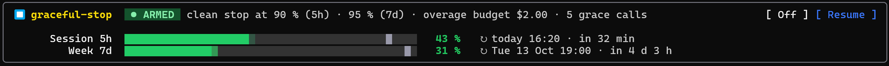

# graceful-stop

> Tested with Claude Code **2.1.295**.

A Claude Code mod that stops your agents cleanly before your Pro or Max credit runs out, instead of letting the limit cut them off mid-task. They wrap up, report, and the orchestrator writes a memo you can resume from once your credit is back.



## How it works

1. **Armed**: the mod watches your 5-hour and 7-day windows.
2. **Stopping**: at 90% of the 5-hour window or 95% of the week, no new subagent can start. Running ones get 5 more tool calls to leave things consistent, then hand back a status report.
3. **Overage**: if a window hits 100%, the stop can finish on extra usage, up to an estimated $2.
4. **Stopped**: the orchestrator turns the reports into `GRACEFUL-STOP_<date>.md` at the root of your repo, and no more requests go out.

The weekly threshold is higher because the last 10% of a week is about one whole session.

Once your credit is back, **Resume** (or `/gs resume`) re-arms the mod and has the orchestrator pick up from the memo. Too early, and it tells you when:

```
Your credits have not been reset yet. Reset time: today 18:40 (in 2 h 13).
```

It also works from a new session in the same repo: the mod remembers the last memo, or takes the newest one at the root. `claude --resume <session>` brings back the conversation too.

The memo and the reports are written in your language. Anything the mod says in the conversation shows up in yellow, so you can tell it apart from the agent's own work.

## Examples

- **A long job hits the limit overnight.** Four subagents are refactoring a codebase when the 5-hour window reaches 90%. They finish their current step and report back. In the morning you find the memo at the root of the repo, and `/gs resume` relaunches what was left.
- **You need to step away.** `/gs stop` winds everything down now, with the same memo, instead of waiting for a threshold.
- **You come back in a new session.** In the same repo, `/gs resume` finds the last memo. If your credit isn't back yet, it tells you when it will be.

## Commands

`/gs` is short for `/graceful-stop`.

| Command | |
| --- | --- |
| `/gs` | Show the card |
| `/gs stop` | Start the clean stop now |
| `/gs resume` | Re-arm and pick up from the memo |
| `/gs on` / `off` | Arm or disarm for this session |

Commands run immediately, even mid-turn. In the panel, click the buttons (fullscreen terminal or desktop app), or press `ctrl+x tab` then `o` / `r`. `ctrl+x ctrl+a` folds the panel.

## Settings

In `/config`, set the **▸ graceful-stop** row to `true` to show the settings (reopen `/config` if they don't appear).

| Setting | Default |
| --- | --- |
| Armed by default at session start | `true` (`false`: each session starts disarmed, `/gs on` arms it) |
| Session threshold | 90% |
| Weekly threshold | 95% |
| Overage budget | $2 |
| Grace tool calls | 5 |

## Install

```sh
claude plugin marketplace add Rctt27/graceful-stop
claude plugin install graceful-stop@graceful-stop
```

Then `/reload-plugins`. From a local clone: `claude --plugin-dir /path/to/graceful-stop`.

**Requirements:** Claude Code with mods (function-hook plugins, early access; tested on 2.1.289 – 2.1.295) and a Pro or Max subscription. Credit percentages only exist on a subscription: with an API key, only `/gs stop` works. Extra usage is optional; without it, the stop has to fit before 100%.

## Good to know

- The overage budget is an estimate at API prices, not your invoice. The monthly cap you set on claude.ai is the real safety net.
- Readings come with each model answer, so usage from elsewhere (another terminal, claude.ai) shows up at the next one. Reset times are shown in local time.
- A tool already running isn't interrupted; the next call is refused.
- Teammates in their own terminal pane are out of reach; subagents started by the Agent tool are covered.
- Reports are captured from Claude Code's internal `SubagentHandback` tool. If that changes, the memo loses them but the rest still works.

## What it touches

Nothing leaves your machine: the mod makes no network calls.

- **Reads:** the session's credit windows and cost, the list of running subagents, and their status reports. Nothing else from the conversation.
- **Writes:** the memo, `GRACEFUL-STOP_<date>.md` at the root of your repo, during a stop only. It copies the subagents' reports into it.
- **Keeps** in Claude Code's plugin store, on your machine: the last credit reading and when it was taken, the last memo's path, and the memos already resumed from.
- **Acts on the session:** it adds its notes to the conversation, submits the resume prompt when you resume, and refuses new subagents, tool calls past the grace calls, and requests once stopped.

## Troubleshooting

- **No card above the prompt:** it's folded. `ctrl+x ctrl+a` unfolds it, and `/gs` shows the card anyway.
- **"No credit reading yet":** the percentages come with the first model answer. With an API key there are none, so only `/gs stop` works.
- **A setting seems ignored:** an out-of-range value falls back to its default, and the session start says which one.
- **Resume finds no memo:** it looks at the root of the current repo and skips memos already resumed from. You can still ask Claude to read a memo yourself.
- **A change doesn't show after an update:** run `/reload-plugins`.

## Support

Bugs and questions: [GitHub issues](https://github.com/Rctt27/graceful-stop/issues).

## Development

```sh
claude plugin validate .
claude plugin test .
```

Load with `--plugin-dir` while editing: each save reloads the mod.

## License

MIT, see [LICENSE](./LICENSE).
